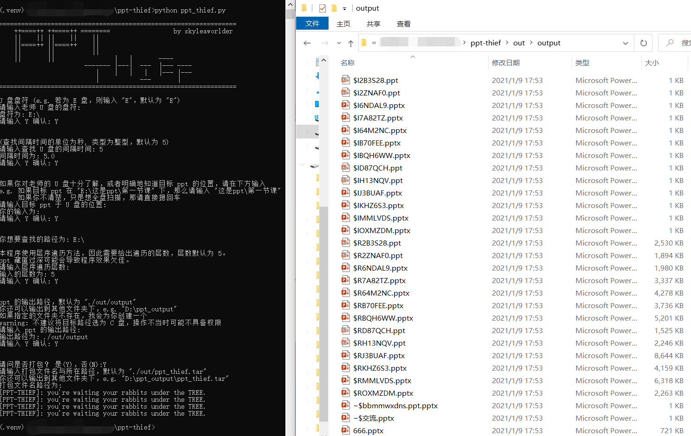

# PPT-thief



## 这是个啥

`PPT-thief`，一个等待着 U 盘插入，并悄悄拷贝盘中 `PPT` 的小陷阱。

## 为什么做这个

2020 春季学期，我上了一门奇怪的课，这课的老师不在群里面发课件。
但其实还好，由于是网课，所以每张停留超过 5 秒钟的画面我都截了下来，并且发给了一起上课的同学，我可真是个带善人。

2020-2021 秋季学期，这位老师还给我们上课，但是这次是真的没办法了。
每次课间，同学上去恳求老师在群里发下课件，老师当时是满口答应，回去就忘得一干二净（其实也不是忘了，就是发到网络上不安全，有被传播的风险

但是这门课的课件对于作业和考试多少还是有些帮助，因此我就有了这个想法：

> 检测 U 盘是否插入，此后拷贝对应路径下的所有课件到外部，之后我再打包、压缩、加密……

只可惜有这个想法已经是最后一堂课之后了，由此便失去了实战的机会……

## 一些说明

### 环境

* `Win10`（学校的电脑大多数是 `Win10 / Win7` 的）
* `Python 3.6`（因为学校老电脑大多数是 3.6 的）
* `VSCode`

### 基本使用

在老师还没进教室之前打开电脑，在电脑上运行 `ppt_thief.py`：

> virtualenv .venv
>
> .venv/Script/activate
>
> pip install -r requirements.txt
>
> python ppt_thief.py

脚本中提供了一系列的参数可供自定义，如：U 盘盘符，查找间隔，特定路径，遍历层数，输出路径，打包选项，压缩选项。

当 `[PPT-THIEF]: you're waiting for your rabbits under the TREE` 之后，一旦老师把 U 盘插在电脑上，拷贝就开始了。

### 大致思路

这玩意儿其实很简单……

```pseudo
while True {
    if smell_u_disk():
        fetch_ppt()
    else:
        time.sleep(5)
}
```

整体上是这么一个思路。但是需要提供一些功能：

* 大循环的 `sleep` 时间应该可以调整；
* 可否通过配置文件来配置程序？
* `smell` 可否自己指定一个盘符？因为可能 `U` 盘自己会使用特定的盘符；
* 这个函数提供的输入参数有哪些？
* 把读取到的 `disk` 放到全局里面好不好？
* 该函数将文件移动到什么地方？不管怎样，默认值需要提供。
* 是否打包、压缩、加密？如果要加密的话，密钥怎么处理？

最后有的实现了，有的没实现，但是加还是好加的。

## TODO LIST

* [x] 简单地窃取 `ppt`
* [x] 打包
* [x] 压缩
* [ ] 支持多种压缩方式
* [ ] 加密
* [ ] 支持多种加密方式
* [ ] 根据配置文件一键完成配置
* [ ] 根据文件信息进行限制
* [ ] 支持多种搜索方法

（所以真的还是很不完善呀）

## 最后

代码写的很乱，注释不多，使用起来可能会有各种各样问题，只是用自己的 U 盘测了一下，感觉凑合能用就直接 `public` 了。

轻喷。
